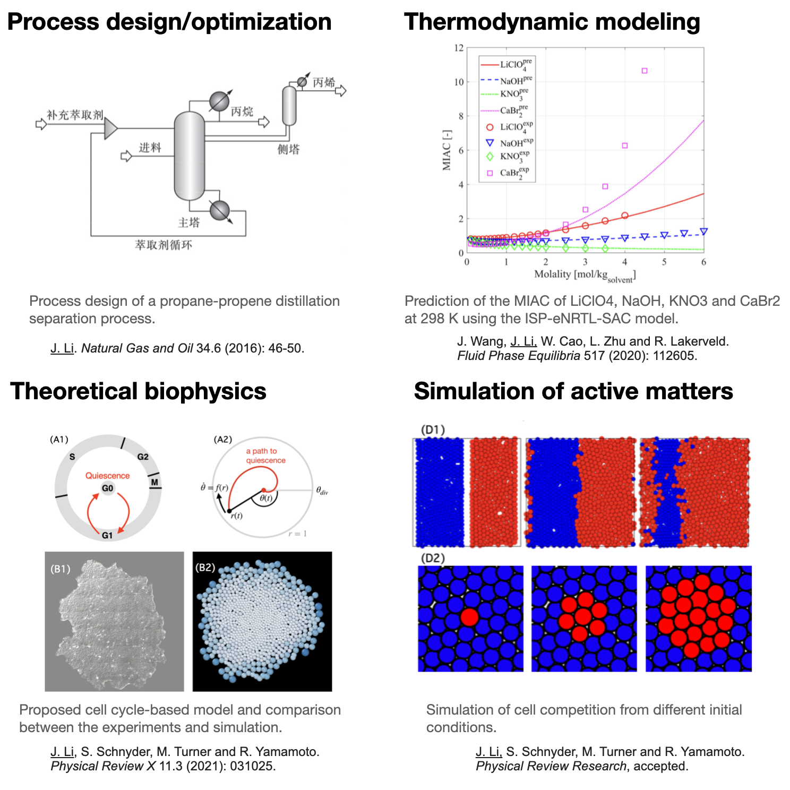

I used to do research in the following areas:

Publications
======
- <ins>J. Li</ins>, S. Schnyder, M. Turner, and R. Yamamoto (2022). Competition between Cell Types under Cell Cycle Regulation with Apoptosis. *Physical Review Research*, accepted.
- <ins>J. Li</ins>, S. Schnyder, M. Turner, and R. Yamamoto (2021). Role of the Cell Cycle in Collective Cell Dynamics. *Physical Review X*, 11, 031025.
-- [Highlighted by Kyoto Univeristy](https://www.kyoto-u.ac.jp/ja/research-news/2021-08-02).
- J. Wang, <ins>J. Li</ins>, W. Cao, L. Zhu, and R. Lakerveld (2020). An ion-specific electrolyte non-random two-liquid segment activity coefficient model with improved predictive capabilities for aqueous electrolyte solutions. *Fluid Phase Equilibria*, 517, 112605.
-  <ins>J. Li</ins> (2016). Comparison of Energy Consumption between Propane-Propene Distillation Separation Precess and Prospect Forecast. *Natural Gas and Oil*, 34(6), 46-50.

Talks
====== 
- Mar 2022, "Competition between Cell Types under Cell Cycle Regulation with Apoptosis", APS March Meeting 2022, Chicago USA & Online.
- Feb 2022, "The role of the cell cycle in collective cell dynamics",Warwick Physics Department Seminar, Warwick UK & Online.
- Jan 2022, "Competition between Cell Types under Cell Cycle Regulation with Apoptosis", Active Matter Workshop 2022, Meiji Univeristy, Tokyo, Japan.
- Oct 2021, "Cell cycle-based model in colony growth and cell competition", Ishimoto Lab seminar, RIMS Kyoto University (Kyoto, Japan).
- Jul 2021, "The role of the cell cycle in collective cell dynamics", PMB 2021, Oxford UK & Online.
- Jul 2021, "Cell cycle-based model in colony growth and cell competition", Takeuchi Lab seminar, Departemnt of Physics, University of Tokyo (Tokyo, Japan).
- Mar 2021, "The role of the cell cycle in collective cell dynamics", APS March Meeting 2021, Online.
- Feb 2021, "The role of the cell cycle in collective cell dynamics", CMCB Lab talk, Warwick University (Warwick, UK) & online.
- Jan 2021, "The role of the cell cycle in collective cell dynamics", Active Matter Workshop 2021, Meiji University (Tokyo, Japan) & online.

<!-- 

Thermodynamic models
======
In pharmecetitical and many other industies, how to predict the propertiet is crucial for the production process.

Simulation of active matters
======
Active matter is matter composed of large numbers of active "agents", each of which consumes energy in order to move or to exert mechanical forces, e.g. cells grow and divide into a larger colony. Due to the feature 

Theoretical biophysics
======
Physics can help to understand biology, as it mainly provides the understanding under the hood. For -->

